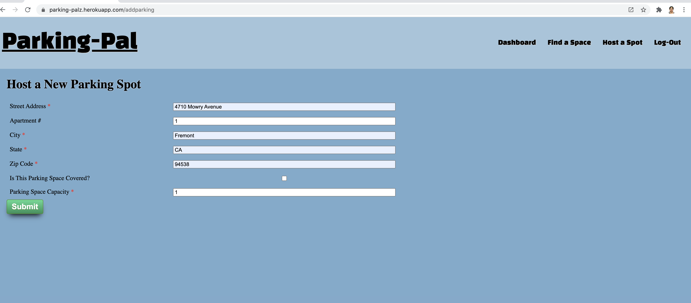
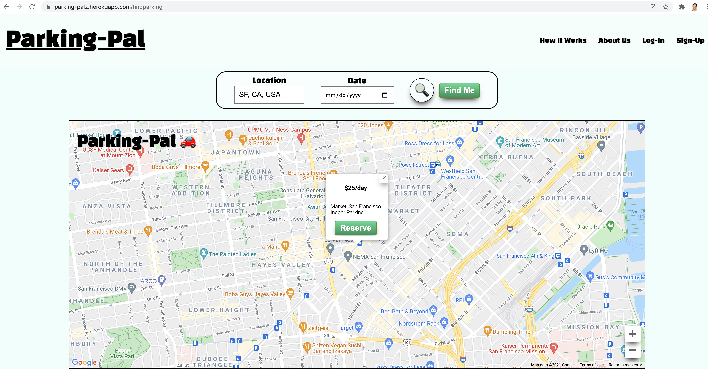
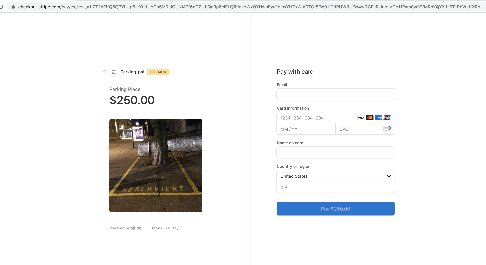

# Parking Pal

ParkingPal connects Providers who want to rent their parking spaces to Consumers who are looking for spaces near their location. When logged into the app, a user can both provide their parking spots or rent out a spot from another user.

When providing a space, a user can add their parking space details, prices and date(s) available. When looking for a space to rent, a user can search for parking by location, and make a reservation to rent a space via stripe transaction.


## Technology 
- MVC (Model View Controller) pattern 
- React Application with 
    - Context API
    - Graph QL API
    - SCSS
    - JavaScript
    - Mongoose
    - MongoDB
    - Node.JS
    - bcrypt
    - Express
- Lucid for basic database design / wireframes / project tasks
- Stripe Trasanction for payments


## Installation

To install dependencies, run the following command from the root directory of this project: 

```npm install```

You will need Node.js and MongoDB installed on your machine to run Parking-Pal locally. You will also need to create two .env files. See the examples below:

### server/.env

AUTH_SECRET_STRING="some secret"
AUTH_SECRET_EXPIRATION="2h"
STRIPE_SECRET_KEY="stripe_key_for_transactions"
EMAIL_SENDER_USERNAME="some@email.account"
EMAIL_SENDER_PASSWORD="some password"

### client/.env

REACT_APP_GOOGLE_API_KEY="maps_api_key_please_dont_use_mine"


## Project Deployment and GitHub Details
 
The project source code can be found at its GitHub repository:
- GitHub - https://github.com/akramsabbah9/parking-pal

This project is deployed to Heroku, a cloud platform service where users can deploy their projects. Try it now!
- Heroku URL - https://parking-pal2.herokuapp.com/


## Images

### Home Page


### Login 


### Host a Spot



### Add Inventory


### Make a Reservation



### Checkout and Payment



## Questions

If you have any additional questions about the project, feel free to open an issue, or contact me directly at akramsabbah9@gmail.com .
